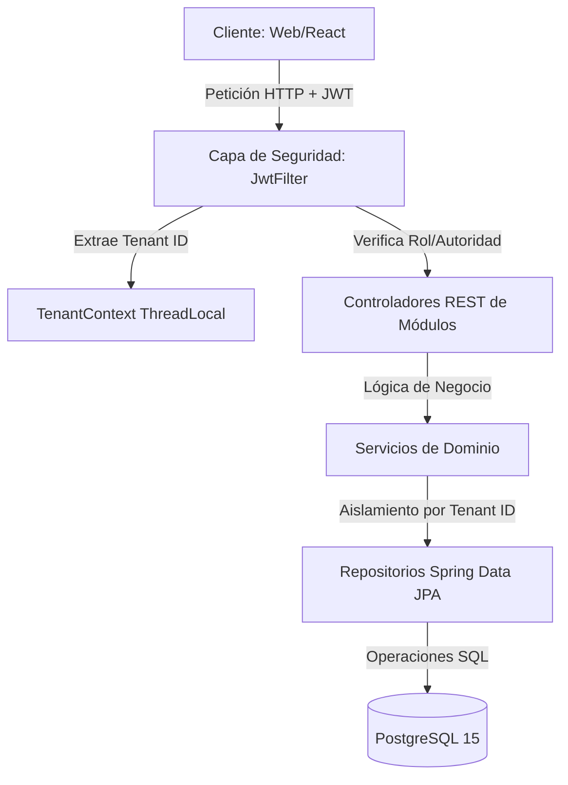

# Documentación Técnica de Módulos - CloudTime v1

Esta documentación detalla la arquitectura, seguridad, modelo de datos y cada una de las secciones funcionales (módulos) implementadas en el backend de **CloudTime v1** (`src/main/java/com/proyecto/version1`).

---

## 1. Arquitectura General del Sistema

El backend está desarrollado sobre el framework **Spring Boot (v4.0.6)** y **Java 21**, utilizando una arquitectura limpia modular orientada a **Features (Características)**.

### 1.1. Seguridad e Identidad (JWT + RSA)
- **Criptografía Asimétrica:** Las firmas de los tokens JWT se validan utilizando llaves asimétricas (RSA) a través de `JwtService` y `KeyUtils`.
- **Filtro de Seguridad (`JwtFilter`):** Intercepta cada petición (excepto `/api/v1/auth/*` y Swagger). Valida la vigencia y autenticidad del token directamente, sin golpear la base de datos en cada request.
- **Aislamiento Multi-tenant (ThreadLocal):** El filtro extrae la propiedad `tenant_id` (UUID de la empresa) del payload del JWT y la almacena en `TenantContext` mediante un `ThreadLocal`. Al finalizar la petición, este contexto se limpia para evitar fugas de memoria.

### 1.2. Estrategia Multi-tenant
- **Shared Table con Discriminador:** Todas las tablas de negocio comparten la misma base de datos física PostgreSQL. La columna discriminadora es `empresa_id` (o `tenant_id` en JWT).
- **Seguridad en Consultas:** Los repositorios y servicios filtran explícitamente utilizando el `TenantContext.getCurrentTenant()`. Esto garantiza la separación lógica absoluta de la información de las distintas empresas.

---

## 2. Inventario de Módulos (Features)

El sistema está estructurado bajo el paquete `com.proyecto.version1.Features`, el cual contiene 12 secciones:

### 2.1. Módulo: Empresas (SaaS Tenant Root)
- **Propósito:** Registro y administración de empresas licenciatarias.
- **Diseño Destacado (Patrón Strategy):** Al registrar una empresa, se preconfiguran automáticamente sus turnos y reglas de asistencia dependiendo de su industria o **Rubro** (`rubro`).
  - `PlantillaHorarioStrategy` (Interfaz): Define el contrato para crear plantillas por industria.
  - `IndustrialPlantillaStrategy`: Configura 3 turnos rotativos (Turno Mañana 06:00-14:00, Turno Tarde 14:00-22:00, Turno Noche 22:00-06:00) con 5 minutos de tolerancia.
  - `TecnologiaPlantillaStrategy`: Configura el "Horario Flexible TI" (08:00-17:00) con 30 minutos de tolerancia.
  - `PlantillaHorarioFactory`: Detecta e inyecta dinámicamente la estrategia adecuada según el rubro.
- **Base de Datos:** Tabla `empresas` (`id`, `nombre`, `nit_rut`, `rubro`, `limite_empleados`, `estado_licencia`, `creado_en`).
- **Endpoints expuestos (`/api/v1/superadmin/empresas`):**
  - `POST /` - Crear empresa (detona `PlantillaHorarioFactory`). *Solo SUPERADMIN*
  - `GET /` - Listar empresas filtradas (paginación, orden y filtros). *Solo SUPERADMIN*
  - `GET /dashboard` - Métricas de consumo global (empresas activas y total de empleados). *Solo SUPERADMIN*
  - `GET /{id}` - Obtener detalles de empresa por ID. *Solo SUPERADMIN*
  - `PUT /{id}` - Actualizar datos permitidos de la empresa. *Solo SUPERADMIN*
  - `DELETE /{id}` - Eliminación lógica/física de empresa. *Solo SUPERADMIN*
  - `PATCH /{id}/estado` - Activar/suspender licencia (`estadoLicencia`: `ACTIVO`, `SUSPENDIDO`). *Solo SUPERADMIN*

### 2.2. Módulo: Empleados (Control de Identidad)
- **Propósito:** Administración del personal y control del portal de autogestión de marcaciones.
- **Base de Datos:** Tabla `empleados` (segregación mediante `empresa_id`). Roles disponibles: `SUPERADMIN`, `ADMIN_RRHH`, `EMPLEADO`. Perfiles de modalidad laboral: `PRESENCIAL`, `HIBRIDO`, `REMOTO`.
- **Controladores Implementados:**
  1. `AdminEmpleadoController` (Roles: `ADMIN_RRHH`):
     - `POST /api/v1/admin/empleados` - Registrar nuevo empleado.
     - `GET /api/v1/admin/empleados` - Listar empleados de la empresa con paginación.
     - `GET /api/v1/admin/empleados/{empleadoId}` - Obtener detalles.
     - `PUT /api/v1/admin/empleados/{empleadoId}` - Actualizar perfil básico.
     - `PATCH /api/v1/admin/empleados/{empleadoId}/foto-patron` - Registrar URL de foto base para biometría facial.
     - `PATCH /api/v1/admin/empleados/{empleadoId}/modalidad` - Cambiar modalidad del perfil.
     - `PATCH /api/v1/admin/empleados/modalidad/lote` - Cambiar modalidad de empleados de forma masiva.
     - `DELETE /api/v1/admin/empleados/{empleadoId}` - Inactivación/eliminación.
  2. `AdminEmpresaDashboardController` (Roles: `ADMIN_RRHH`):
     - `GET /api/v1/admin/dashboard/tiempo-real` - Estadísticas de marcas diarias (presentes, tarde, faltas, etc.).
  3. `EmpleadoPanelController` (Roles: `EMPLEADO`):
     - `GET /api/v1/empleado/panel` - Configuración dinámica del panel (qué botones habilitar, si requiere QR, GPS o cámara).
     - `POST /api/v1/empleado/panel/asistencia` - Registro transaccional de marcas (Entrada, Almuerzo, Salida) - *ver detalle en sección 2.6*.
     - `GET /api/v1/empleado/panel/vacaciones/saldo` - Saldo personal de vacaciones.
     - `POST /api/v1/empleado/panel/vacaciones` - Enviar solicitud propia de vacaciones.
     - `POST /api/v1/empleado/panel/justificaciones` - Enviar soporte de incidencia/falta.
     - `GET /api/v1/empleado/panel/historial-mensual` - Calendario mensual de marcas del trabajador.
     - `GET /api/v1/empleado/panel/ticker` - Conexión por **Server-Sent Events (SSE)** para actualizar en tiempo real el cronómetro de horas netas de trabajo y estado laboral actual.

### 2.3. Módulo: Reglas de Horario (Parámetros Operativos)
- **Propósito:** Configurar la tolerancia, retardos y horas oficiales para calcular inasistencias o recargos.
- **Base de Datos:** Tabla `reglas_negocio_horarios`.
- **Endpoints expuestos (`/api/v1/admin/reglas-horario`):**
  - `POST /` - Crear regla de horario.
  - `GET /` - Listar reglas de la empresa.
  - `GET /paginated` - Listar reglas con paginación y ordenamiento.
  - `GET /{id}` - Obtener por ID.
  - `GET /empresa/primaria` - Obtener la regla principal activa de la organización.
  - `PUT /{id}` - Actualizar parámetros de la regla (tolerancia, límites de abandono).
  - `DELETE /{id}` - Eliminar regla.

### 2.4. Módulo: Calendario Híbrido (Organización Flexible)
- **Propósito:** Planificar qué días específicos del mes un empleado con perfil `HIBRIDO` debe laborar de forma `PRESENCIAL` o `REMOTO`.
- **Base de Datos:** Tabla `calendario_hibrido` (relación única `empleado_id` + `fecha`).
- **Endpoints expuestos (`/api/v1/admin/calendario-hibrido`):**
  - `POST /` - Asignar día y carácter laboral (Presencial o Remoto).
  - `PUT /{id}` - Actualizar asignación.
  - `GET /` - Consultar calendario de un empleado en un rango de fechas.
  - `PUT /lote` - Upsert masivo (guardar o actualizar en bloque).
  - `DELETE /{id}` - Eliminar asignación.

### 2.5. Módulo: Geocercas Remotas (Geofencing)
- **Propósito:** Definir las ubicaciones permitidas (como hogar o sedes remotas) para las marcaciones de empleados remotos.
- **Base de Datos:** Tabla `geocercas_remotas` (latitud, longitud y radio de tolerancia en metros).
- **Endpoints expuestos (`/api/v1/admin/geocercas`):**
  - `POST /` - Crear geocerca para un empleado.
  - `PUT /{id}` - Actualizar coordenadas o radio.
  - `GET /` - Listar geocercas, opcionalmente filtrado por `empleadoId`.
  - `GET /{id}` - Obtener por ID.
  - `DELETE /{id}` - Eliminar geocerca.

### 2.6. Módulo: Registros de Asistencias (Motor Transaccional)
- **Propósito:** Registrar marcas y verificar el cumplimiento de reglas espaciales y biométricas en tiempo real.
- **Base de Datos:** Tabla `registro_asistencia` (inmutable por día para evitar duplicados mediante llave única `empleado_id` + `fecha`).
- **Lógica de Validación Core en Marcación:**
  Al invocar `POST /api/v1/empleado/panel/asistencia`, el servicio ejecuta las siguientes reglas determinísticas según la modalidad calculada del día:
  
  1. **Si el día es PRESENCIAL:**
     - Obligatorio utilizar canal QR físico (`QR_FISICO`) o dinámico (`QR_DINAMICO`).
     - Para `QR_DINAMICO` se valida que el token del QR no esté vacío (mitiga ataques de replay).
  2. **Si el día es REMOTO:**
     - Debe originarse desde `BOTON_REMOTO`.
     - Obligatoria la verificación facial (`esFacialVerificado = true`).
     - Obligatorio proveer precisión de GPS (`precisionGpsAccuracy` no nulo).
  3. **Estados de Entrada:**
     - Si la hora de marcación supera la `hora_entrada_oficial` + `minutos_tolerancia_retardo` de la regla de horario primaria, se marca automáticamente como `RETARDO`, de lo contrario es `A_TIEMPO`.

### 2.7. Módulo: Justificaciones de Incidencias (`Backups_Incidencias`)
- **Propósito:** Flujo de aprobación y gestión de evidencias para subsanar faltas o retardos detectados por el sistema.
- **Base de Datos:** Tabla `backup_incidencias_justificaciones`. Relacionada a un `registro_asistencia_id` (incidencia). Almacena la `url_comprobante_s3`.
- **Flujo y Ciclo de Vida (`estado_solicitud`):**
  1. El empleado solicita justificación adjuntando el motivo y la URL del comprobante. Queda en estado `PENDIENTE`.
  2. RRHH revisa la bandeja de solicitudes.
  3. Si RRHH **Aprueba**: El estado pasa a `APROBADO`, y automáticamente modifica el registro de asistencia origen cambiando su estado a `FALTA_JUSTIFICADA` (o retardo justificado).
  4. Si RRHH **Rechaza**: Pasa a `RECHAZADO`, sin modificar el estado de asistencia original.
- **Endpoints expuestos (`/api/v1/admin/justificaciones`):**
  - `POST /` - Crear justificación administrativa.
  - `GET /pendientes` - Obtener bandeja de justificaciones pendientes para RRHH.
  - `PUT /{justificacionId}/aprobar` - Aprobar y actualizar asistencia.
  - `PUT /{justificacionId}/rechazar` - Rechazar solicitud.

### 2.8. Módulo: Vacaciones (Workflows de Descanso)
- **Propósito:** Gestionar solicitudes de días de vacaciones y descontar automáticamente del saldo acumulado.
- **Base de Datos:** Tabla `solicitudes_vacaciones`. Relacionada a la columna `saldo_vacaciones` de la tabla `empleados`.
- **Flujo de Aprobación:**
  1. Empleado consulta su saldo (`saldo_vacaciones`) y envía solicitud (`fecha_inicio` a `fecha_fin`).
  2. El sistema valida en BD que las fechas sean coherentes y haya saldo suficiente.
  3. RRHH aprueba o rechaza:
     - **Aprobar:** Calcula el número de días solicitados y los descuenta del saldo del empleado en la base de datos en una sola transacción atómica (`saldo_vacaciones = saldo_vacaciones - diasSolicitados`).
- **Endpoints expuestos (`/api/v1/admin/vacaciones`):**
  - `POST /` - Registrar solicitud manual por RRHH.
  - `GET /pendientes` - Listar solicitudes pendientes de aprobación.
  - `PUT /{solicitudId}/aprobar` - Aprobar y descontar saldo.
  - `PUT /{solicitudId}/rechazar` - Rechazar.
  - `GET /saldo/{empleadoId}` - Consultar saldo disponible de un empleado.

### 2.9. Módulo: Anomalías Graves de Auditoría (`Anomalias`)
- **Propósito:** Registro y persistencia de eventos irregulares detectados por el sistema de seguridad (p. ej., suplantación de ubicación "Mock Location", discrepancias faciales o marcaciones fuera de geocerca).
- **Base de Datos:** Tabla `anomalias_graves_auditoria` (`tipo_anomalia`, `detalles_tecnicos`, `notificado_via_sns`).
- **Estado Actual:** Actualmente implementado únicamente a nivel de entidad JPA en Java y tabla en BD PostgreSQL. Diseñado para integrarse en la **Fase 2 y 4 (AWS SNS & Lambda)** para el broker de notificaciones y telemetría de fraude.

### 2.10. Módulo: Contratos de Empleados
- **Propósito:** Almacenar parámetros comerciales individuales de salario base y vigencia laboral, insumo clave para la liquidación mensual.
- **Base de Datos:** Tabla `contratos_empleados` (`salario_base_mensual`, `tipo_moneda`, `tipo_contrato`, `fecha_ingreso`, `fecha_retiro`, `activo`).
- **Estado de Integración:** Entidad JPA y repositorio activos. Consumido directamente por el motor de pre-nómina para calcular el descuento de salario proporcional por faltas.

### 2.11. Módulo: Configuración de Recargos de Empresa (`RecargosConfiguracion`)
- **Propósito:** Parametrizar factores de recargos por horas extras, dominicales, festivos y multas de retardos a nivel corporativo (Tenant isolated).
- **Base de Datos:** Tabla `configuracion_recargos_empresa` (`factor_hora_extra_diurna`, `factor_hora_extra_nocturna`, `factor_hora_dominical_festiva`, `multa_retardo_por_minuto`).
- **Llamado de Atención:** La lógica de servicio `ConfiguracionRecargosServiceImpl` está completa, pero **no posee controlador REST expuesto directamente**. Actualmente se alimenta de datos iniciales / seed en base de datos y es consumida por el módulo de Reportes de Pre-Nómina.

### 2.12. Módulo: Pre-Nómina y Reportes (`Reportes_Prenomina`)
- **Propósito:** Motor matemático que compila registros de asistencia mensuales, calcula inasistencias injustificadas, calcula horas extras (diurnas, nocturnas y festivas) y genera la liquidación financiera del periodo.
- **Base de Datos:** Tabla `reportes_prenomina_mensual`.
- **Características Especiales:**
  - **ColombiaFestivosUtils:** Incluye la lógica de cálculo dinámico de festivos colombianos (incluyendo ley Emiliani para traslados a lunes festivos, Semana Santa, etc.) para la correcta clasificación de horas dominicales y festivas.
  - **Fórmula de Liquidación:**
    $$\text{Salario Proporcional} = \text{Salario Base} \times \frac{\text{Días Efectivos} + \text{Días Justificados}}{30}$$
    $$\text{Ganancia Extras} = \text{Horas Calculadas} \times \text{Factor de Recargo}$$
    $$\text{Deducciones} = \text{Faltas Injustificadas} \times \text{Costo Diario} + \text{Multas por Retardos}$$
    $$\text{Monto Neto Pagar} = (\text{Salario Proporcional} + \text{Ganancia Extras}) - \text{Deducciones}$$
- **Endpoints expuestos (`/api/v1/admin/reportes-prenomina`):**
  - `POST /generar` - Procesar y persistir reportes de pre-nómina para un periodo.
  - `GET /` - Listar reportes persistidos en base de datos.
  - `GET /consolidado` - Previsualizar consolidado en tiempo real en memoria.
  - `GET /export/csv` - Descargar archivo plano CSV.
  - `GET /export/excel` - Descargar archivo binario Excel (`.xlsx`).
  - `GET /export/pdf` - Descargar documento PDF.
  - `GET /{id}` - Obtener reporte específico.

---

## 3. Infraestructura de Autenticación (`/api/v1/auth`)

- **Endpoints Públicos:**
  - `POST /login` - Retorna `access_token` y `refresh_token` (`Bearer`).
  - `POST /register` - Crear un usuario administrador o empleado.
  - `POST /refresh` - Renovación de tokens mediante el Refresh Token.

---

## 4. Próximos Pasos Identificados para AWS (Según Plan de Implementación)

1. **Reemplazo de URL manuales en Justificaciones:** Modificar el flujo de `Backups_Incidencias` y `Vacaciones` para no enviar una URL estática de comprobante, sino usar URLs firmadas y uploads directos a **S3** (`StorageService`).
2. **Alertas automáticas vía SNS:** Agregar publicación de eventos en `VacacionesServiceImpl` y `BackupIncidenciasServiceImpl` para notificaciones asíncronas de aprobaciones o anomalías.
3. **Generación asíncrona de Pre-Nómina:** Mover la generación de PDF/Excel pesados a colas **SQS** o funciones **Lambda** para mitigar tiempos de espera síncronos de la API.
