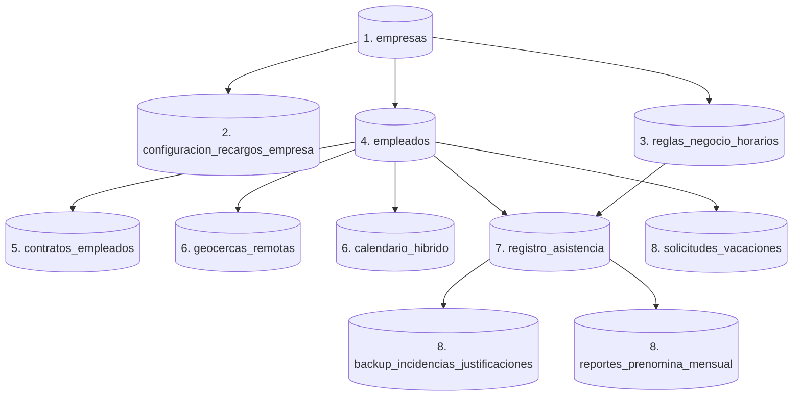

# GUÍA DE CONFIGURACIÓN Y INICIALIZACIÓN DE EMPRESA (TENANT)

Esta guía define el flujo secuencial y determinístico necesario para dar de alta una nueva empresa (tenant) en **CloudTime v1**. 

Dado que el sistema cuenta con un esquema de base de datos relacional PostgreSQL con fuertes restricciones de claves foráneas (`FOREIGN KEY`) y constraints `CHECK`, **debe seguir este orden exacto** para evitar errores de integridad referencial.

---

## 1. Grafo de Dependencias de Base de Datos

El siguiente diagrama muestra el flujo de dependencias lógicas del esquema:



---

## 2. Flujo de Inicialización Secuencial (Paso a Paso)

### Paso 1: Registro de la Empresa (SuperAdmin)
- **Actor:** SuperAdmin
- **Descripción:** Crea la entidad raíz de la empresa. Al crearse, el sistema ejecuta automáticamente una precarga de plantillas de turnos por defecto (`Turno Mañana`, `Turno Tarde`, `Turno Noche` si es `INDUSTRIAL`, o `Horario Flexible TI` si es `TECNOLOGIA`) en la tabla `reglas_negocio_horarios`.
- **Ruta:** `POST /api/v1/superadmin/empresas`
- **Payload mínimo:**
```json
{
  "nombre": "Nueva Empresa S.A.S.",
  "nitRut": "901999999-5",
  "rubro": "TECNOLOGIA",
  "limiteEmpleados": 100,
  "estadoLicencia": "ACTIVO"
}
```

---

### Paso 2: Parametrización de Recargos Corporativos
- **Actores:** Administrador de RRHH (`ADMIN_RRHH`) o **SuperAdmin** (`SUPERADMIN`)
- **Descripción:** Configura el porcentaje de recargos por horas extras, festivos y multas por retrasos a nivel empresa. **Debe crearse antes de calcular reportes o realizar marcaciones.**
- **Rutas:**
  - Para `ADMIN_RRHH` (Autenticado bajo su propio tenant): `POST /api/v1/admin/recargos`
  - Para `SUPERADMIN` (Delegado para cualquier empresa): `POST /api/v1/superadmin/empresas/{empresaId}/recargos`
- **Payload mínimo:**
```json
{
  "factorHoraExtraDiurna": 1.25,
  "factorHoraExtraNocturna": 1.75,
  "factorHoraDominicalFestiva": 2.00,
  "multaRetardoPorMinuto": 0.00
}
```

---

### Paso 3: Ajuste de Reglas de Horario
- **Actores:** Administrador de RRHH (`ADMIN_RRHH`) o **SuperAdmin** (`SUPERADMIN`)
- **Descripción:** Ajusta o añade las jornadas de trabajo asociadas a la empresa especificada. Cada empresa debe poseer al menos una regla de horario configurada (el backend requiere una regla activa para procesar la tolerancia de las entradas de los empleados).
- **Rutas:**
  - Para `ADMIN_RRHH` (Autenticado bajo su propio tenant): `POST /api/v1/admin/reglas-horario`
  - Para `SUPERADMIN` (Delegado para cualquier empresa): `POST /api/v1/superadmin/empresas/{empresaId}/reglas-horario`
- **Payload mínimo:**
```json
{
  "empresaId": "ID-EMPRESA-CREADA-PASO-1",
  "descripcion": "Horario Normal de Oficina",
  "horaEntradaOficial": "08:00:00",
  "horaSalidaOficial": "17:00:00",
  "minutosToleranciaRetardo": 15,
  "tiempoLimiteFaltaMinutos": 120
}
```

---

### Paso 4: Creación de Colaboradores (RRHH)
- **Actor:** Administrador de RRHH (`ADMIN_RRHH`)
- **Descripción:** Registra las cuentas de usuario de los empleados. La base de datos asocia al empleado con la empresa mediante `empresa_id` y valida su rol y modalidad perfil.
- **Ruta:** `POST /api/v1/admin/empleados`
- **Payload mínimo:**
```json
{
  "nombreCompleto": "Juan Pérez",
  "email": "juan.perez@empresa.com",
  "password": "PasswordSeguro123!",
  "rol": "EMPLEADO",
  "modalidadPerfil": "HIBRIDO",
  "saldoVacaciones": 15,
  "activo": true
}
```
> [!IMPORTANT]
> Los roles permitidos son `EMPLEADO` y `ADMIN_RRHH`. La modalidad permitida es `PRESENCIAL`, `HIBRIDO` o `REMOTO`. 
> El sistema normaliza automáticamente a mayúsculas estos valores en la base de datos para satisfacer las restricciones `CHECK`.

---

### Paso 5: Registro del Contrato Laboral
- **Actor:** Administrador / Seed de Base de Datos
- **Descripción:** Define las condiciones salariales y contractuales del colaborador (salario nominal básico e ingreso). **Este paso es indispensable para el motor de pre-nómina, ya que de lo contrario el cálculo mensual fallará al no encontrar contrato vigente.**
- **Canal:** En esta versión del backend, se realiza mediante semilla SQL o integración de BD (no hay controlador expuesto).
- **Registro SQL de Ejemplo:**
```sql
INSERT INTO contratos_empleados (id, empleado_id, salario_base_mensual, tipo_moneda, tipo_contrato, fecha_ingreso, activo)
VALUES (
    uuid_generate_v4(), 
    'ID-EMPLEADO-CREADO-PASO-4', 
    2500000.00, 
    'COP', 
    'TERMINO_INDEFINIDO', 
    '2026-01-01', 
    true
);
```

---

### Paso 6: Configuración Operativa (Geocercas y Turnos Flexibles)
Una vez que el empleado tiene un perfil creado, se le deben asignar sus restricciones según la modalidad elegida:

#### A) Si el Empleado es REMOTO (Requiere Geocerca)
- **Ruta:** `POST /api/v1/admin/geocercas`
- **Payload mínimo:**
```json
{
  "empleadoId": "ID-EMPLEADO-CREADO-PASO-4",
  "descripcion": "Casa Juan Pérez",
  "latitud": 4.60971,
  "longitud": -74.08175,
  "radioToleranciaMetros": 100
}
```

#### B) Si el Empleado es HÍBRIDO (Requiere Calendario de Turnos)
- **Ruta:** `PUT /api/v1/admin/calendario-hibrido/lote`
- **Payload mínimo:**
```json
{
  "empleadoId": "ID-EMPLEADO-CREADO-PASO-4",
  "asignaciones": [
    {
      "empleadoId": "ID-EMPLEADO-CREADO-PASO-4",
      "fecha": "2026-06-01",
      "caracterDia": "PRESENCIAL"
    },
    {
      "empleadoId": "ID-EMPLEADO-CREADO-PASO-4",
      "fecha": "2026-06-02",
      "caracterDia": "REMOTO"
    }
  ]
}
```

---

## 3. Flujo Transaccional Operativo (Post-Inicialización)

Una vez completados los pasos anteriores, la empresa está lista para operar:
1. El empleado marca asistencia (`POST /api/v1/empleado/panel/asistencia`).
2. El sistema valida si el día laboral es remoto (valida geocerca y foto) o presencial (valida código QR).
3. Al finalizar el mes, RRHH genera la liquidación y pre-nómina (`POST /api/v1/admin/reportes-prenomina/generar`), la cual lee los registros de asistencia, inasistencias injustificadas, calcula horas extras aplicando la ley de festivos colombiana, y deduce penalizaciones basadas en la configuración de recargos.
