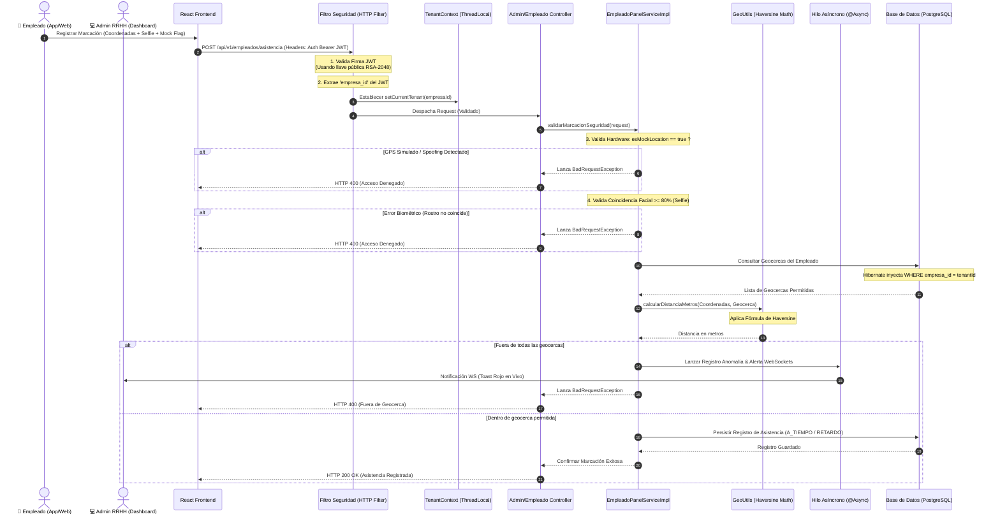

# 📊 Ecosistema CloudTime: Arquitectura de la Aplicación y Seguridad Lógica

Este repositorio alberga el backend del ecosistema **CloudTime**, una plataforma SaaS multi-tenant diseñada para el control y la auditoría de la asistencia laboral. La solución implementa un circuito de seguridad estricto que no delega la confianza en el cliente, validando de forma activa la biometría facial, la geolocalización frente a geocercas y la integridad del hardware del dispositivo.

---

## 🗺️ Diagrama de Arquitectura de la Aplicación

El siguiente diagrama detalla el flujo lógico de una petición de marcación de asistencia remota y su monitoreo administrativo en tiempo real, ilustrando cómo interactúan el frontend, las capas de seguridad, los servicios asíncronos y la base de datos:

---

## 💻 Arquitectura y Conectividad Frontend (React)

El frontend del sistema está construido sobre **React**, estructurado mediante componentes funcionales modulares y hooks personalizados para la gestión de estados globales y la comunicación con el servidor.

### 🔌 Conexiones de Red y Protocolos
1.  **API REST (HTTP/S):** Todas las peticiones transaccionales ordinarias de administración y autogestión de empleados (vacaciones, parámetros de configuración, visualización de marcas) se realizan mediante peticiones HTTPS asíncronas tradicionales.
2.  **WebSockets (WS/S):** El Panel de Monitoreo RRHH mantiene una conexión bidireccional permanente con el servidor a través de la dirección `ws://[servidor]/ws/ubicaciones`.
    *   Este canal de WebSockets se suscribe a eventos de tipo `ANOMALIA_GRAVE` (como `MOCK_LOCATION_DETECTADA` o `FACE_MISMATCH`).
    *   Al recibir una anomalía, el cliente React renderiza de inmediato un Toast crítico de color rojo e interactúa con el mapa del panel para resaltar el marcador del empleado infractor con una animación de pulso concéntrico.

### 📸 Captura Biométrica y GPS en Dispositivos
*   **Biometría:** En dispositivos móviles y entornos web de escritorio, React accede a la cámara nativa para capturar una instantánea del rostro (selfie). El archivo capturado se sube temporalmente al storage seguro del sistema backend para su posterior evaluación.
*   **Geolocalización Nativa:** Para aplicaciones híbridas (Capacitor/React Native), el frontend interactúa con las APIs nativas del sistema operativo (usando plugins de geolocalización) para recuperar no solo las coordenadas crudas, sino también los metadatos de precisión del hardware provistos por el sensor.

---

## 🔑 Mecanismos de Seguridad Backend

### 1. Criptografía Asimétrica (Asymmetric JWT)
El mecanismo de autenticación del backend utiliza **criptografía asimétrica** basada en el estándar **RSA de 2048 bits** para firmar y validar los JSON Web Tokens (JWT). Esta estrategia proporciona una separación de responsabilidades robusta y previene la falsificación de identidad:
*   **Firma (Private Key):** Durante el proceso de inicio de sesión (`/api/v1/auth/login`), el servidor de autenticación utiliza la clave privada almacenada de forma segura en `keys/local-only/private_key.pem` para firmar digitalmente el token JWT generado.
*   **Verificación (Public Key):** Cada petición entrante que cruza la seguridad es analizada en el filtro HTTP (`JwtService.java`). Este componente lee el token utilizando únicamente la clave pública cargada desde `keys/local-only/public_key.pem`. De esta forma, si el componente de recursos se desacoplara en el futuro, no requiere poseer la clave privada para verificar la integridad del token.

### 2. Aislamiento Multi-tenant (DISCRIMINATOR)
Para garantizar la confidencialidad de la información y cumplir con los estándares de software SaaS, CloudTime implementa un modelo de datos multi-tenant compartiendo base de datos y esquema, pero aislando lógicamente a los inquilinos (empresas) mediante la estrategia **Discriminator** a nivel de Hibernate:
*   **Captura de Inquilino:** El filtro de seguridad lee el claim de la empresa (`empresa_id`) contenido dentro de la firma JWT validada.
*   **Contexto del Hilo (ThreadLocal):** Este identificador de empresa se guarda en el contenedor `TenantContext` mediante un objeto estático `ThreadLocal<UUID> CURRENT_TENANT`. Esto garantiza que la identidad del inquilino quede atada de forma exclusiva al hilo de ejecución HTTP Tomcat asignado para procesar esa petición en particular.
*   **Resolución en Hibernate:** Hibernate intercepta el contexto mediante la implementación de `CurrentTenantIdentifierResolver` (`TenantIdentifierResolver.java`). De forma transparente y en tiempo de compilación/consulta, Hibernate inyecta una cláusula `WHERE empresa_id = ?` en todas las consultas de base de datos (`SELECT`, `UPDATE`, `DELETE`) impidiendo la fuga involuntaria de información hacia otras empresas del sistema.

### 3. Validación de Hardware (Prevención de Spoofing GPS)
Para evadir fraudes en la marcación (uso de aplicaciones móviles que simulan coordenadas falsas, llamadas *Fake GPS*), el sistema valida el hardware emisor de la siguiente forma:
*   **Flag de GPS Simulado:** El frontend extrae el atributo de simulación a nivel nativo (`isFromMockProvider` de Android o equivalentes en iOS) y lo mapea en el payload JSON de la petición HTTP bajo el campo `"esMockLocation"`.
*   **Bloqueo y Alerta:** En el backend, `validarMarcacionSeguridad(...)` intercepta esta bandera. Si se detecta un valor verdadero (`esMockLocation == true`), se cancela inmediatamente la marcación, se deniega la transacción arrojando una excepción `BadRequestException` y se publica de forma asíncrona un evento de anomalía grave en el broker de alertas para notificar de inmediato al administrador.
*   **Validación de Precisión de Coordenadas:** Se analiza además la precisión del sensor (`precisionGpsAccuracy`). Una precisión demasiado perfecta en exteriores (ej. `accuracy == 0.0`) o nula levanta sospechas de que las coordenadas han sido forzadas mediante software emulador, sirviendo como una segunda barrera defensiva.

### 4. Geolocalización y Fórmula de Haversine
Cuando un empleado bajo modalidad **REMOTO** registra asistencia, el sistema no solo comprueba coordenadas crudas, sino que valida si el punto se sitúa físicamente dentro de una de las geocercas permitidas para ese trabajador en particular:
*   **Consulta Multi-Cerca:** Se consulta a la base de datos la lista completa de geocercas parametrizadas para el empleado (casa, sedes alternas, etc.), aislando la consulta por su `empresa_id` actual.
*   **Cálculo de Distancia Terrestre:** Para cada geocerca, el backend calcula la distancia lineal entre la ubicación de marcación del empleado $(lat_1, lon_1)$ y el centro de la geocerca $(lat_2, lon_2)$ utilizando la **Fórmula de Haversine**, la cual modela la curvatura de la Tierra:

$$d = 2R \cdot \operatorname{arcsin}\left(\sqrt{\sin^2\left(\frac{\Delta\phi}{2}\right) + \cos(\phi_1)\cos(\phi_2)\sin^2\left(\frac{\Delta\lambda}{2}\right)}\right)$$

Donde:
*   $R = 6,371,000$ metros (radio medio de la Tierra).
*   $\phi_1, \phi_2$ son las latitudes expresadas en radianes.
*   $\Delta\phi = \phi_2 - \phi_1$ y $\Delta\lambda = \lambda_2 - \lambda_1$ (diferencias de latitud y longitud en radianes).

*   **Validación de Tolerancia:** Si la distancia física calculada en metros es menor o igual al radio de tolerancia permitido (`radio_tolerancia_metros`), se concede el acceso. Si el empleado se encuentra fuera de todos los radios, la marcación se rechaza de inmediato con el mensaje `"El dispositivo se encuentra fuera de la geocerca permitida."` y se crea una anomalía de tipo `FUERA_DE_GEOCERCA`.

---

## 🧮 Motor de Cálculo Salarial y Reglas Laborales

La generación y consolidación de la pre-nómina mensual (`ReportesPrenominaMensualServiceImpl.java`) opera bajo estrictas normativas salariales inspiradas en la legislación laboral colombiana:

### 1. Base del Período de Pago
El motor de nómina calcula los montos basándose en un mes laboral estándar de **30 días**, con un estándar mensual de **240 horas laborables** (`HORAS_MENSUALES_ESTATICAS`).
*   **Salario Diario:** $\text{Salario Base Mensual} / 30$
*   **Salario Hora:** $\text{Salario Base Mensual} / 240$

### 2. Algoritmo Gregoriano de Festivos y Feriados
El sistema requiere calcular dinámicamente qué días del mes calendario corresponden a festivos nacionales colombianos para aplicar los recargos correspondientes del 2.0x (dominical/festivo) en lugar de las tarifas normales de horas extras. 
Para resolver los **feriados móviles religiosos** de la Iglesia Católica y los trasladados por la Ley Emiliani, el sistema utiliza el **Algoritmo Gregoriano de Gauss** (`ColombiaFestivosUtils.java`):
*   Se calcula la fecha del Domingo de Resurrección (Pascua) para el año correspondiente mediante divisiones modulares y restos matemáticos.
*   A partir del Domingo de Pascua, se deducen por sumatoria simple de días las fechas de: Jueves Santo (Pascua - 3), Viernes Santo (Pascua - 2), Ascensión del Señor (Pascua + 43), Corpus Christi (Pascua + 64) y Sagrado Corazón de Jesús (Pascua + 71).
*   Se evalúa la ley Emiliani para desplazar los feriados que caen a mitad de semana al lunes siguiente cuando corresponda.

### 3. Fórmulas de Pago y Recargos Salariales
El salario neto mensual a pagar a cada empleado se consolida de la siguiente manera:

$$\text{Monto Neto} = \text{Salario Base Proporcional} + \text{Monto Ganancia Extras} - \text{Monto Deducciones}$$

*   **Salario Base Proporcional:** Se paga sobre los días laborados efectivos sumados a los días de vacaciones autorizadas:
    $$\text{Salario Base Proporcional} = \text{Salario Diario} \times (\text{Días Trabajados} + \text{Días Vacaciones})$$
*   **Monto Ganancia Extras:** Depende del tipo de día laborado:
    *   **Día Ordinario:**
        *   **Hora Extra Diurna:** $\text{Horas Extra Diurnas} \times \text{Salario Hora} \times 1.25$
        *   **Hora Extra Nocturna:** $\text{Horas Extra Nocturnas} \times \text{Salario Hora} \times 1.75$
    *   **Día Dominical o Festivo:**
        *   Las horas extras trabajadas aplican el recargo festivo parametrizado en la empresa:
            $$\text{Monto Extra Festivo} = \text{Horas Extra} \times \text{Salario Hora} \times \text{Factor Dominical / Festivo (2.00x)}$$
*   **Monto Deducciones:** Compuesto por ausencias y penalizaciones de minutos tarde:
    $$\text{Deducciones} = (\text{Salario Diario} \times \text{Faltas Injustificadas}) + (\text{Multa Retardo por Minuto} \times \text{Minutos Tardanza})$$
    Los minutos de tardanza son consolidados dinámicamente comparando la hora de marcación de entrada frente a la `hora_entrada_oficial` más el margen parametrizado de `minutos_tolerancia_retardo`.
